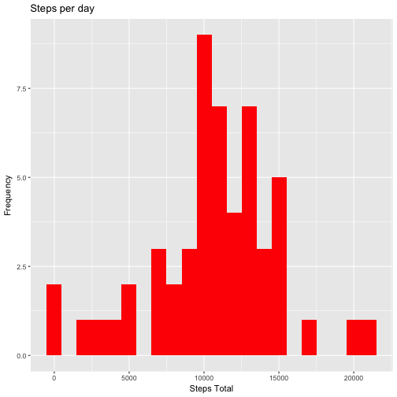
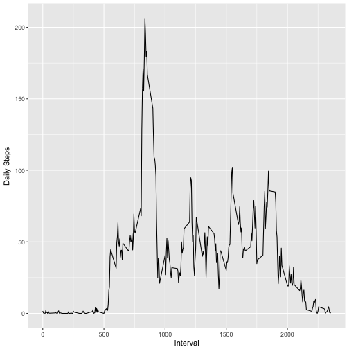
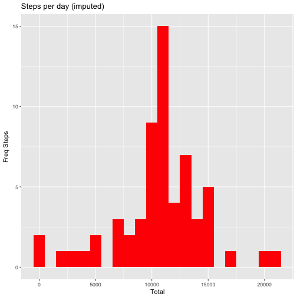
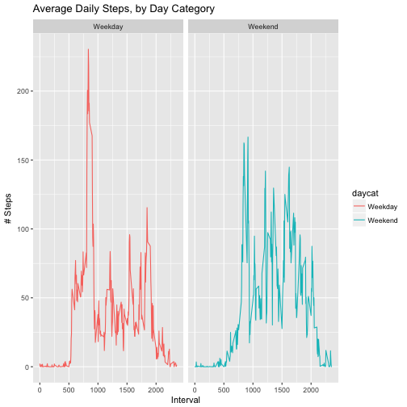

# Step 1 - Code for reading in the dataset and/or processing the data

```r
setwd("/Users/rorr/Desktop/Data Science/R Class/Reproducible Research")
library(ggplot2)
library(dplyr)
library(knitr)
activity <- read.csv("activity.csv")

summary(activity)  
```

```
##      steps                date          interval     
##  Min.   :  0.00   2012-10-01:  288   Min.   :   0.0  
##  1st Qu.:  0.00   2012-10-02:  288   1st Qu.: 588.8  
##  Median :  0.00   2012-10-03:  288   Median :1177.5  
##  Mean   : 37.38   2012-10-04:  288   Mean   :1177.5  
##  3rd Qu.: 12.00   2012-10-05:  288   3rd Qu.:1766.2  
##  Max.   :806.00   2012-10-06:  288   Max.   :2355.0  
##  NA's   :2304     (Other)   :15840
```

```r
activity$date<- as.Date(activity$date) 
```

#Step 2 - Histogram of the total number of steps taken each day

```r
Step_tot<- activity%>%
  group_by(date)%>%
        filter(!is.na(steps))%>%
        summarise(total = sum(steps, na.rm=TRUE))
Step_tot
```

```
## # A tibble: 53 × 2
##          date total
##        <date> <int>
## 1  2012-10-02   126
## 2  2012-10-03 11352
## 3  2012-10-04 12116
## 4  2012-10-05 13294
## 5  2012-10-06 15420
## 6  2012-10-07 11015
## 7  2012-10-09 12811
## 8  2012-10-10  9900
## 9  2012-10-11 10304
## 10 2012-10-12 17382
## # ... with 43 more rows
```

```r
ggplot(Step_tot, aes(x = total)) +
        geom_histogram(fill = "red", binwidth = 1000) +
        labs(title = "Steps per day", x = "Steps Total", y = "Frequency")
```


# Step 3 - Mean and Median

```r
Mean_step <- mean(Step_tot$total, na.rm = TRUE)
Median_step <- median(Step_tot$total, na.rm = TRUE)

Mean_step
```

```
## [1] 10766.19
```

```r
Median_step
```

```
## [1] 10765
```


```r
# Step 4 - Time series plot of the average number of steps taken
avgsteps <- activity%>%
        group_by(interval)%>%
        filter(!is.na(steps))%>%
        summarise(avg.steps = mean(steps, na.rm=TRUE))
avgsteps
```

```
## # A tibble: 288 × 2
##    interval avg.steps
##       <int>     <dbl>
## 1         0 1.7169811
## 2         5 0.3396226
## 3        10 0.1320755
## 4        15 0.1509434
## 5        20 0.0754717
## 6        25 2.0943396
## 7        30 0.5283019
## 8        35 0.8679245
## 9        40 0.0000000
## 10       45 1.4716981
## # ... with 278 more rows
```

```r
ggplot(avgsteps, aes(interval, avg.steps)) + geom_line() +
   xlab("Interval") + ylab("Daily Steps")
```



# Step 5 - The 5-minute interval that, on average, contains the maximum number of steps

```r
avgsteps[which.max(avgsteps$avg.steps),]
```

```
## # A tibble: 1 × 2
##   interval avg.steps
##      <int>     <dbl>
## 1      835  206.1698
```

```r
length(is.na(activity$steps))
```

```
## [1] 17568
```

```r
sum(is.na(activity$steps))
```

```
## [1] 2304
```
# Step 6 - Code to describe and show a strategy for imputing missing data

```r
activity_u<- activity
NAsteps<- is.na(activity$steps)
avg_per_I<- tapply(activity_u$steps, activity_u$interval, mean, na.rm=TRUE, simplify = TRUE)
activity_u$steps[NAsteps] <- avg_per_I[as.character(activity_u$interval[NAsteps])]

#No NAs?
sum(is.na(activity_u))
```

```
## [1] 0
```

```r
activity_u$date<- as.Date(activity_u$date) 

Step_tot_u<- activity_u%>%
  group_by(date)%>%
        summarise(total = sum(steps))
Step_tot_u
```

```
## # A tibble: 61 × 2
##          date    total
##        <date>    <dbl>
## 1  2012-10-01 10766.19
## 2  2012-10-02   126.00
## 3  2012-10-03 11352.00
## 4  2012-10-04 12116.00
## 5  2012-10-05 13294.00
## 6  2012-10-06 15420.00
## 7  2012-10-07 11015.00
## 8  2012-10-08 10766.19
## 9  2012-10-09 12811.00
## 10 2012-10-10  9900.00
## # ... with 51 more rows
```
# Step 7 - Histogram of the total number of steps taken each day after missing values are imputed

```r
ggplot(Step_tot_u, aes(x = total)) +
        geom_histogram(fill = "red", binwidth = 1000) +
        labs(title = "Steps per day (imputed)", x = "Total", y = "Freq Steps")
```



```r
Mean_step_u <- mean(Step_tot_u$total, na.rm = TRUE)
Median_step_u <- median(Step_tot_u$total, na.rm = TRUE)
Mean_step_u
```

```
## [1] 10766.19
```

```r
Median_step_u
```

```
## [1] 10766.19
```
# Step 8 - Panel plot comparing the average number of steps taken per 5-minute interval across weekdays and weekends

```r
activity_u<- activity_u%>%
        mutate(daycat= ifelse(weekdays(activity_u$date)=="Saturday" | 
        																									weekdays(activity_u$date)=="Sunday", "Weekend", "Weekday"))

avgsteps2<- activity_u%>%
        group_by(interval, daycat)%>%
        summarise(avg.steps_u = mean(steps, na.rm=TRUE))
head(avgsteps2)
```

```
## Source: local data frame [6 x 3]
## Groups: interval [3]
## 
##   interval  daycat avg.steps_u
##      <int>   <chr>       <dbl>
## 1        0 Weekday  2.25115304
## 2        0 Weekend  0.21462264
## 3        5 Weekday  0.44528302
## 4        5 Weekend  0.04245283
## 5       10 Weekday  0.17316562
## 6       10 Weekend  0.01650943
```

```r
panel_plot<- ggplot(avgsteps2, aes(x =interval , y=avg.steps_u, color=daycat)) +
       geom_line() + labs(title = "Average Daily Steps, by Day Category", x = "Interval", y = "# Steps") +
       facet_wrap(~daycat, ncol = 2, nrow=1)
print(panel_plot)
```


